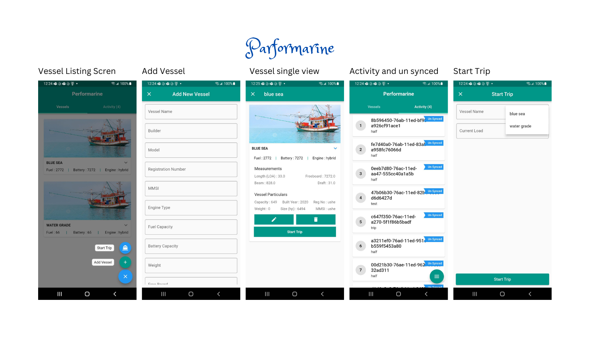

# Performarine

## Project Setup:
- setup the flutter and IDE: https://docs.flutter.dev/get-started/editor
- post configuring the application use the below commands
  - flutter doctor (to check the set up status and issues)
  - flutter --version(check the version)
  - flutter clean (remove the builds and cache from the project)
  - flutter pub get (install the required packages)
  - flutter run --release/debug/profile (run the code in emulator/ physical device)
  - flutter build apk --release/debug/profile (build the android executables- APK)
  - flutter build ios --release/debug/profile (build the IOS executables- APK)
  - pod cache clean --all (remove the pod cache)
  - pod deintegrate (remove the pod specification from project)
  - pod install (install the ios dependencies)
  - pod updates (update the ios dependencies)
  - open Runner.xcworkspace(open the project in xcode)
  - flutter create . (to install the latest flutter sdk changes)

## Sensor data format
### Accelerometer (ACC)
- ACC,-0.13636240374208206,0.05717136928190788,9.824958347138905,2022-12-16T17:38:16.503109Z
  - X Accel
  - Y Accel
  - Z Accel
  - UTC ISO 8601 Timestamp
### User Accelerometer (UACC)
- UACC,-0.13636240374208206,0.05717136928190788,9.824958347138905,2022-12-16T17:38:16.503109Z
  - X Accel
  - Y Accel
  - Z Accel
  - UTC ISO 8601 Timestamp
  Gyroscope (GYRO)
  GYRO,-0.0009162978967651725,-0.003512475173920393,0.004428773187100887,2022-12-16T17:38:14.820518Z
  X Rotation
  Y Rotation
  Z Rotation
  UTC ISO 8601 Timestamp
  Magnetometer (MAG)
  MAG,-76.19021911621094,-59.91785850524902,-76.19021911621094,2022-12-16T17:38:14.932642Z
  Magnetic Field’s X
  Magnetic Field’s Y
  Magnetic Field’s Z
  UTC ISO 8601 Timestamp
  World Positioning (GPS)
  GPS,44.6276332,-63.5902818,3.9159998893737793,
  -17.196053035159977,298.0196838378906,3.1892454624176025,0.2001989781856537,2022-12-16T17:38:16.621Z
  Latitude
  Longitude
  GPS Accuracy
  Altitude
  Heading
  Speed
  Speed Accuracy
  Timestam
## Read Documentation
  ### By using the below commands we can view the documentation in the local server with 8080 port and open the local host http://localhost:8080/
  - dart pub global activate dhttpd 
  - dhttpd --path documentation

## Preview



## Sprint10 Notes
  - User kills the application and reopens - need to show a popup containing "Last time you used performarine. there is a trip in progress. do you want to end the trip or continue? ("End trip", "continue trip")
  - Firebase crash analytics Implemented
  - User feedback is added in all screens. Uploading image files.


  # Flutter Version Using
  3.16.3
   Engine • revision 54a7145303
   Tools • Dart 3.2.3 
    DevTools 2.28.4   


    #LPR Docs 


   
## 📚 Overview: 
- [LPR callBack Handler](#LPR-callBack-Handler)
- [Class Structure](#Class-Structure)
- [Public Properties and Methods](#Public-Properties-and-Methods)
- [Dispose](#Dispose)
- [Example](#Example)
- [Key Points of LPR CallBack Handler](#Key-Points-of-LPR-CallBack-Handler)
- [Widget Structure of BLEDevices](#Widget-Structure-of-BLEDevices)
- [Properties and Methods of BLEDevices](#Properties-and-Methods-of-BLEDevices)
- [Key Points of BLEDevices](Key-Points-of-BLEDevices)
- [Widget Structure of LPRDevices](#Widget-Structure-of-LPRDevices)
- [Properties and Methods of LPRDevices](#Propertioes-and-Methods-of-LPRDevices)
- [LPRDevice Usage Example](#LPRDevice-Usage-Example)
- [Widget Structure of StreamBuilder](#Widget-Structure-of-StreamBuilder)
- [Properties of StreamBuilder](#Properties-of-StreamBuider)
- [StreamBuilder Usage Example](#StreamBuilder-Usage-Example)


##  LPR CallBack Handler
-   The LPRCallbackHandler class serves as a central handler for managing callbacks and streaming data related to a Bluetooth Low Energy (BLE) device with 
    specific UUIDs for services and characteristics.
-   This handler allows you to establish and manage connections, receive data, and handle disconnections for a BLE device.

## Class Structure
The class follows the Singleton design pattern, ensuring that only one instance of LPRCallbackHandler can exist in the application. This is achieved through a private constructor and a static instance _instance.  
-LPRCallbackHandler._internal();  
factory LPRCallbackHandler() => _instance; 

## Public Properties and Methods

  ## Properties 
- callBackLprTanspernetserviecId: A callback function for LPR Transparent Service ID and UART TX. 
- callBackLprTanspernetserviecIdStatus: A callback function for the status of the LPR Transparent Service ID. 
- callBackLprUartTxStatus: A callback function for the status of the LPR UART TX. 
- callBackconnectedDeviceName: A callback function for the connected Bluetooth device's name. 
- callBackLprStreamingData: A callback function for streaming LPR data. 
- onDeviceDisconnectCallback: A callback function triggered upon device disconnection. 
- lprService: Represents the Bluetooth service for LPR communication. 
- lprDataStream: A stream of lists containing LPR data.
  
  ## Methods 
- listenToDeviceConnectionState: Establishes and manages the connection to a BLE device.
-  It listens for changes in the device's connection state, discovers  services, and sets up data characteristics for streaming LPR data.
     void listenToDeviceConnectionState({/* ... */}) async;

 ## Dispose
-  Closes the stream controller to avoid memory leaks when the LPRCallbackHandler instance is no longer needed.
   
   void dispose(); 
   getLPRConfigartion: Retrieves LPR configuration values stored securely.
   Future<Map<String, dynamic>> getLPRConfigartion() async; 
 ## Example
```
 // Initialize the LPRCallbackHandler  
  LPRCallbackHandler lprHandler = LPRCallbackHandler().instance; 
 // Set up callbacks l 
  prHandler.callBackLprStreamingData = (data) {  // Handle LPR data streaming  
};  
// Connect to a BLE device 
 lprHandler.listenToDeviceConnectionState( callBackLprStreamingData:lprHandler.callBackLprStreamingData, connectedDevice: /* BluetoothDevice instance */, );  
// Dispose of the handler when no longer needed  
lprHandler.dispose(); 
```   
## Key Points of  LPR CallBack Handler

- The listenToDeviceConnectionState method assumes specific UUIDs for LPR services and characteristics. Ensure these UUIDs match your device's specifications. 
- Handle the callbacks appropriately based on your application's requirements. 
 
## Connect BLEDevices
 -The ConnectBLEDevices widget is a Flutter StatefulWidget that provides a user interface for connecting to a Bluetooth Low Energy (BLE) device, specifically an 
  LPR device.
 -It integrates with the LPRCallbackHandler class to manage BLE connections and handle LPR data streaming.
 ## Widget Structure of BLEDevices
  Description
   -  A stateful widget for managing BLE connections and displaying LPR data.
  Constructor:
   -  ConnectBLEDevices({super.key}) 
  State Class:
   -  _ConnectBLEDevicesState 
 Description: The state class that manages the internal state and behavior of the ConnectBLEDevices widget. 
## Properties and Methods of BLEDevices
 ## Properties
  -scaffoldKey: A GlobalKey for managing the state of a Scaffold widget. 
  -openedSettingsPageForPermission: A boolean flag indicating whether the settings page for permissions has been opened. 
  - isLocationPermitted, isStartButton, isScanningBluetooth, isLocationDialogBoxOpen, isBluetoothPermitted, isBluetoothSearching, isRefreshList, 
    isClickedOnForgetDevice, Boolean flags to control various states and actions. 
  - lprHandler: An instance of the LPRCallbackHandler class. 
  - bluetoothName: The name of the Bluetooth device, default is 'LPR'. 
  - autoConnectStreamSubscription, autoConnectIsScanningStreamSubscription: Stream 	subscriptions for auto-connect events. 
  - lprTanspernetserviecIdStatus, lprUartTxStatus, bluettothDeviceName, transperentServiceId, lprUartTXId: Strings to store various connection-related status and 
    information.
 ## Methods
 - initState(): Initializes the state of the widget, checks permissions, and sets up necessary dependencies. 
 - dispose(): Disposes of resources and disconnects from connected BLE devices when the widget is disposed. 
 - build(BuildContext context): Builds the UI of the widget.    
 - Other utility methods for handling Bluetooth connections, permissions, and UI interactions
## Key Points of BLEDevices
 - Customize the UI and behavior according to your application requirements. 
 - Permissions and Bluetooth settings handling may vary between iOS and Android platforms.

## ConnectLPRDevices
  -The LPRBluetoothList widget is a customizable component designed to display a list of available Bluetooth devices and provide functionality for selecting a 
   device, starting the connection, and listening to LPR  data. It interacts with the LPRCallbackHandler class to manage Bluetooth connections and handle LPR data 
   streaming. 
## Widget Structure of LPRDevices 
  -LPRBluetoothList 
   Description: A configurable widget for displaying and interacting with Bluetooth devices. 

## Properties and Methods of LPRDevices
Properties
- selectedBluetoothDevice: Callback function called when a Bluetooth device is selected. It initiates the connection and sets up data streaming using the 
  LPRCallbackHandler.
- comingFrom: A string identifier indicating the source or context of the widget.
- dialogContext: The BuildContext associated with the dialog.
- setDialogSet: A function for setting the dialog state.
- connectedDeviceId: The ID of the currently connected Bluetooth device.
- connectedBluetoothDevice: The Bluetooth device that is currently connected.
- onSelected: Callback function called when a Bluetooth device is selected.
- onBluetoothConnection: Callback function called when there is a change in Bluetooth connection status.
- Other properties for customizing the appearance and behavior of the widget.
Methods
-Utility methods for handling Bluetooth connections, selecting devices, and updating UI state. 

## LPRDevice Example
```
 LPRBluetoothList( 

  selectedBluetoothDevice: (bluetoothDevice) { 

    LPRCallbackHandler().listenToDeviceConnectionState( 

      connectedDevice: bluetoothDevice, // ... other connection state callbacks 

    ); 

  }, 

  comingFrom: 'lpr_test', 

  dialogContext: dialogContext, 

  setDialogSet: setDialogState, 

  connectedDeviceId: connectedDeviceId, 

  connectedBluetoothDevice: connectedBluetoothDevice, 

  onSelected: (value) {   // Handle selected Bluetooth device 
  }, 
  onBluetoothConnection: (value) {    // Handle Bluetooth connection status change 

  }, // ... other properties 

) 
```  

## StreamBuilder
 The StreamBuilder widget in the provided code snippet is used to asynchronously listen to a stream of LPR data. It updates the UI whenever new data is available 
 in the stream. Below is the documentation for this part of the code: 

 ## Widget Structure of StreamBuilder

   StreamBuilder<List<String>> 
   Description: A Flutter widget that listens to a stream and rebuilds the UI with the latest data received from the stream. 

## Properties of StreamBuilder
  - stream: The stream to which the widget subscribes for data updates. In this case, it is the lprHandler.lprDataStream.
  - builder: A callback function that specifies how to rebuild the UI when new data is available in the stream. It takes the current BuildContext and a snapshot 
    of the most recent interaction with the stream.
  - snapshot: A representation of the most recent data received from the stream, including its connection state, error, and the data itself. 

## StreamBuilder Usage Example
 - The StreamBuilder is utilized to create a responsive UI that updates whenever new LPR data is received.
```
   Expanded( 

  child: StreamBuilder<List<String>>( 

    stream: lprHandler.lprDataStream, 

    builder: (context, snapshot) { 

      if (snapshot.hasData) { 

        // If there is data in the stream, display it using a ListView 

        return ListView.builder( 

          itemCount: snapshot.data!.length, 

          shrinkWrap: true, 

          itemBuilder: (context, index) { 

            // Build a Text widget for each item in the LPR data list 

            return Text(snapshot.data![index].toString()); 

          }, 

        ); 

      } else { 

        // If there is no data in the stream, display a message 

        return Center( 

          child: Text('No LPR data available'), 

        ); 

      } 

    }, 

  ), 

), 
```
